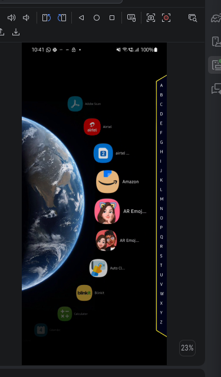

# TGLM-The-Great-Mobile-Launcher
A custom Mobile Launcher for android. Will soon be the top. i hope. i wish.

Requirements and build
To run:
1. Android version greater than 10, tested on android 13 and 15
2. To run, download APK in releases tab, set as home launcher et voila

To Build yourself you need:
1. Android Studio
2. Android SDK
3. Emulator or phone with android 13 or newer if you wanna test it
4. USB debugging enabled

Follow these steps:
1. Clone the repo or download zip
2. open project in android studio and allow it to finish sdk and gradle setup
3. connect android phone with usb debugging enabled
4. select it as target
5. click run and there you gp

Set TGML as the launcher
After install android will ask what launcher to use. Select TGML - The Great Mobile Launcher and choose always if you want it to be default

Current Feature List:
1. Scrollable app arc with smooth slowdown
2. Quick jump alphabet bar
3. A cooool background
4. Support to display infinite apps and open them tooo

Future possibilities:
INFINITE
but mainly clock, performance, ui overhaul and so on

**Important**

TGML is currently a development project. The launcher may change significantly between builds, and some features may not work correctly on every Android device.

For development, installing directly through Android Studio is recommended.